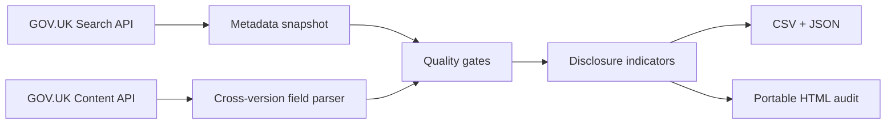

# UK Public Sector Algorithm Transparency Audit

[](https://github.com/SanketCSakhare/uk-public-sector-algorithm-transparency-audit/actions/workflows/ci.yml)
[](https://www.python.org/)
[](https://www.nationalarchives.gov.uk/doc/open-government-licence/version/3/)

A reproducible analysis of how UK public-sector organisations describe algorithmic tools in the official [GOV.UK Algorithmic Transparency Records repository](https://www.gov.uk/algorithmic-transparency-records).

This portfolio project combines public-sector data engineering, AI-governance measurement, data-quality controls, predictive modelling, automated testing, and portable HTML reports. It uses only official GOV.UK data; the core audit is dependency-free and the optional modelling workflow uses scikit-learn.

> **Evidence boundary:** the project measures whether selected governance topics have substantive public text. It does **not** assess whether a tool is safe, fair, lawful, accurate, or compliant. A disclosure indicator is not proof that a control is effective.

## What the project demonstrates

- Official API ingestion with retries, concurrency, provenance, and a dated snapshot
- Cross-version parsing of semi-structured ATRS records
- Eight documented governance disclosure indicators
- Automated completeness, uniqueness, validity, and source-reconciliation checks
- Reproducible CSV, JSON, and static HTML outputs
- A leakage-controlled benchmark spanning logistic regression, TF-IDF, random forest, gradient boosting, and probability calibration
- Model selection that favours interpretability when performance is practically tied
- Unit tests and GitHub Actions CI

## Outputs

- [`reports/index.html`](reports/index.html) — portable governance audit
- [`reports/model_evaluation.html`](reports/model_evaluation.html) — predictive-model evaluation
- [`models/MODEL_CARD.md`](models/MODEL_CARD.md) — intended use, validation, and limitations
- [`results/model_experiments.tsv`](results/model_experiments.tsv) — append-only experiment comparison
- [`results/oof_predictions.csv`](results/oof_predictions.csv) — repeated out-of-fold predictions
- [`data/processed/atrs_audit.csv`](data/processed/atrs_audit.csv) — record-level analytical table
- [`reports/summary.json`](reports/summary.json) — headline metrics
- [`reports/data_quality.json`](reports/data_quality.json) — source and pipeline checks
- [`data/snapshot/atrs_metadata.json`](data/snapshot/atrs_metadata.json) — official search metadata snapshot

## Snapshot results (17 August 2026)

- **142** official records reconciled to the GOV.UK-reported total
- **36** publishing organisations represented
- **0** duplicate source URLs and **0** missing titles, organisations, dates, or ATRS versions
- **88** production records; the remaining records span pre-deployment, pilot/beta, and retired phases
- **94.5/100** mean disclosure coverage across the eight documented indicators

These figures describe the dated snapshot in this repository and will change as GOV.UK publishes or updates records.

## Predictive modelling benchmark

The optional ML workflow predicts the publisher-supplied label **production vs non-production** from public governance metadata. It compares six candidates under stratified five-fold cross-validation repeated five times, with a frozen random seed and ROC-AUC as the primary metric.

| Candidate | Mean ROC-AUC | Decision |
|---|---:|---|
| TF-IDF + logistic regression | 0.690 | Within 0.01 of selected model; not worth the extra complexity |
| **Metadata logistic regression** | **0.682** | **Selected for interpretability** |
| Balanced random forest | 0.668 | Discarded |
| Calibrated gradient boosting | 0.634 | Discarded |
| Gradient boosting | 0.625 | Discarded |
| Prior-only baseline | 0.500 | Baseline |

The selected model's repeated out-of-fold predictions achieved ROC-AUC **0.693**, average precision **0.793**, and balanced accuracy **0.620**. These results demonstrate modest signal, not deployment readiness. The 142-record sample is small, the uncertainty across folds is substantial, and the target is not an independent measure of quality. See the [predictive modelling methodology](docs/PREDICTIVE_MODELING.md) before interpreting the figures.

## Governance indicators

The pipeline checks for substantive disclosure on:

1. named accountability;
2. human oversight;
3. appeal or review routes;
4. impact assessments;
5. risks and mitigations;
6. performance evidence;
7. operational data governance; and
8. monitoring or maintenance.

Each indicator contributes equally to a 0–100 **disclosure coverage score**. The rules are intentionally transparent and reviewable in [`scoring.py`](src/atrs_audit/scoring.py). See the [methodology](docs/METHODOLOGY.md) for interpretation limits.

## Reproduce the analysis

Python 3.10 or newer is sufficient; the runtime uses only the standard library.

```bash
python -m pip install -e .
python -m atrs_audit.cli --output-root .
python -m unittest discover -s tests -v
```

Run the optional predictive-modelling benchmark with:

```bash
python -m pip install -e ".[ml]"
python -m atrs_audit.modeling --input data/processed/atrs_audit.csv --output-root .
```

The live run makes read-only requests to the official GOV.UK Search API and Content API. It fails closed if the number of fetched records does not match the total reported by GOV.UK or if duplicate record URLs are found.

## Architecture



## Responsible interpretation

- Records span several ATRS versions with different field structures.
- A blank or non-applicable field can be legitimate.
- Presence of text is not evidence of implementation quality.
- Publication coverage cannot reveal systems that were not disclosed.
- Comparisons are descriptive and should not be used to rank public bodies.

## CV-ready description

**UK Public Sector Algorithm Transparency Audit — Python, data engineering, responsible AI**

- Engineered a reproducible Python pipeline across **142 official GOV.UK Algorithmic Transparency Records**, with concurrent API ingestion, cross-version HTML parsing, provenance snapshots, and automated data-quality gates.
- Designed **eight explainable AI-governance disclosure indicators** and produced record-level CSV/JSON outputs plus a portable HTML audit, explicitly separating transparency evidence from claims about safety or compliance.
- Benchmarked **six predictive classifiers** using repeated stratified cross-validation; selected an interpretable logistic model under a predeclared simplicity rule and documented modest out-of-fold discrimination (**ROC-AUC 0.693**) in a model card.

The figures above are accurate for the repository snapshot dated 17 August 2026. Rerun the pipeline and read `reports/summary.json` before claiming a later snapshot.

## Sources and licensing

Source data comes from the [GOV.UK ATRS finder](https://www.gov.uk/algorithmic-transparency-records), the [ATRS guidance](https://www.gov.uk/government/publications/guidance-for-organisations-using-the-algorithmic-transparency-recording-standard), and the [Data and AI Ethics Framework](https://www.gov.uk/government/publications/data-ethics-framework/data-and-ai-ethics-framework).

Code is MIT licensed. Reproduced UK public-sector information is used under the [Open Government Licence v3.0](https://www.nationalarchives.gov.uk/doc/open-government-licence/version/3/). This independent project is not affiliated with or endorsed by the UK Government.
